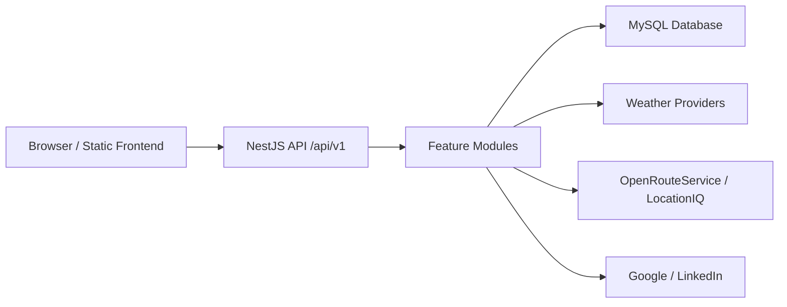

<p align="center">
  
</p>
<h1 align="center">🚀 Wasel-Palestine</h2>

<p align="center">
  Smart Route Optimization & Checkpoint Awareness System
</p>
<p align="center">
  <a href="http://nestjs.com/" target="blank"></a>
</p>

[circleci-image]: https://img.shields.io/circleci/build/github/nestjs/nest/master?token=abc123def456
[circleci-url]: https://circleci.com/gh/nestjs/nest

  <p align="center">A progressive <a href="http://nodejs.org" target="_blank">Node.js</a> framework for building efficient and scalable server-side applications.</p>
<p align="center">
  
  
  
</p>

<p align="center">
  <a href="#tech-stack"></a>
  <a href="#tech-stack"></a>
  <a href="#database"></a>
  <a href="#frontend"></a>
  <a href="#authentication-and-roles"></a>
</p>

<p align="center">
  <a href="#quick-start">Quick Start</a>
  |
  <a href="#main-features">Features</a>
  |
  <a href="#api-overview">API</a>
  |
  <a href="#documentation">Docs</a>
  |
  <a href="#known-limitations">Known Limitations</a>
</p>

---

## Overview

Wasel Palestine is a full-stack mobility and road-awareness platform. It provides citizen-facing tools for viewing incidents, checkpoints, community reports, weather, alerts, and route recommendations, and it provides an admin dashboard for managing operational traffic data.

The application is implemented as a NestJS backend with a MySQL database and a static HTML/CSS/JavaScript frontend served by the backend.

## Problem Statement

Road movement can be affected by checkpoints, closures, delays, accidents, hazards, and weather conditions. Wasel Palestine centralizes this information so citizens can make better route decisions and administrators can manage verified operational data.

The project supports:

- Public visibility into incidents, checkpoints, and reports.
- Citizen participation through report submission, voting, and confirmation.
- Admin moderation and management workflows.
- Alert subscriptions for relevant road events.
- Route estimation with checkpoint and incident avoidance.

## Main Features

### Citizen Features

- Sign up and sign in with email/password.
- Sign in with Google or LinkedIn.
- View map data for incidents, checkpoints, and reports.
- Browse incidents and incident details.
- Submit personal road-condition reports.
- View community reports.
- Vote on and confirm reports.
- Manage alert subscriptions.
- View alert inbox/unread state.
- Estimate routes with optional checkpoint and incident avoidance.
- Update profile, avatar, password, and language preference.

### Admin Features

- Dashboard with operational metrics.
- Incident management.
- Checkpoint management.
- User management.
- Report moderation queue.
- Audit log browsing.
- Performance reports page.
- API monitor page.
- System settings management.
- Citizen preview support for selected frontend behavior.

## Tech Stack

### Backend

- NestJS 11
- TypeScript
- TypeORM
- MySQL through `mysql2`
- `@nestjs/config`
- `@nestjs/jwt`
- Passport JWT strategy
- bcrypt password hashing
- `class-validator` and `class-transformer`
- Swagger/OpenAPI through `@nestjs/swagger`
- `@nestjs/event-emitter`
- `@nestjs/serve-static`
- Axios for external HTTP calls

### Frontend

- Static HTML/CSS/JavaScript
- Hash-based routing
- Fetch/Axios API services
- Leaflet map widgets
- SweetAlert2 UI flows
- localStorage session/runtime state
- Manual English/Arabic localization helpers
- Google and LinkedIn auth handlers

### External Services

- OpenRouteService for route planning.
- LocationIQ as route provider fallback.
- WeatherAPI.com for current weather when configured.
- Open-Meteo as weather fallback.
- Google OAuth userinfo.
- LinkedIn OAuth.

## Architecture

The project is a single NestJS application that serves API routes and static frontend files.



Backend bootstrap behavior:

- Global API prefix: `/api`
- API versioning: URI versioning, default `v1`
- Main API base: `/api/v1`
- Swagger UI: `/api/docs`
- Static frontend root: `Frontend`
- CORS enabled
- Global validation pipe
- Global serializer interceptor
- Global exception filter
- Custom global auth middleware

## Project Structure

```text
.
|-- Backend/
|   `-- src/
|       |-- app.module.ts
|       |-- main.ts
|       |-- common/
|       |-- core/
|       `-- modules/
|           |-- alerts/
|           |-- audit-log/
|           |-- auth/
|           |-- checkpoints/
|           |-- incidents/
|           |-- map/
|           |-- reports/
|           |-- route/
|           |-- system-settings/
|           |-- users/
|           `-- weather/
|-- Frontend/
|   |-- Services/
|   |-- core/
|   |-- features/
|   |   |-- admin/
|   |   |-- citizen/
|   |   `-- public/
|   `-- views/
|       |-- admin/
|       `-- citizen/
|-- docs/
|-- tests/
|-- package.json
|-- nest-cli.json
`-- tsconfig.json
```

## Backend Modules

### Auth

Handles signin, signup, JWT generation, JWT validation, Google login, LinkedIn OAuth, and profile endpoints.

Main endpoints:

```text
POST  /api/v1/auth/signin
POST  /api/v1/auth/signup
GET   /api/v1/auth/profile
PATCH /api/v1/auth/profile
POST  /api/v1/auth/google
GET   /api/v1/auth/linkedin
GET   /api/v1/auth/linkedin/callback
POST  /api/v1/auth/linkedin
```

### Users

Manages user accounts, citizen listing, current user lookup, registration metrics, and profile-related data.

Main endpoints:

```text
GET    /api/v1/users
POST   /api/v1/users
POST   /api/v1/users/create
GET    /api/v1/users/citizens
GET    /api/v1/users/me
GET    /api/v1/users/counts
GET    /api/v1/users/registration-trend
GET    /api/v1/users/registration-buckets
GET    /api/v1/users/search/email
GET    /api/v1/users/:id
PATCH  /api/v1/users/:id
DELETE /api/v1/users/:id
```

### Incidents

Stores road events such as closures, delays, accidents, and weather hazards. Incidents support severity, active/closed status, verification state, optional checkpoint linkage, status history, and alert dispatch.

Incident types:

```text
CLOSURE
DELAY
ACCIDENT
WEATHER_HAZARD
```

Incident severities:

```text
LOW
MEDIUM
HIGH
CRITICAL
```

Incident statuses:

```text
ACTIVE
CLOSED
```

### Checkpoints

Stores checkpoints with name, coordinates, location text, description, current status, and status history.

Checkpoint statuses:

```text
OPEN
DELAYED
CLOSED
RESTRICTED
```

### Reports and Moderation

Allows citizens to submit reports and admins to moderate them. Reports support categories, statuses, duplicate detection, rate limiting, votes, confirmations, and moderation audit records.

Report categories:

```text
checkpoint_issue
road_closure
delay
accident
hazard
other
```

Report statuses:

```text
pending
under_review
approved
rejected
resolved
```

### Alerts

Allows citizens to create alert preferences by area and incident category. Verified or resolved incidents can generate alert messages and per-user alert records.

### Map

Exposes public map feeds:

```text
GET /api/v1/map/incidents
GET /api/v1/map/checkpoints
GET /api/v1/map/reports
```

### Route Planner

Estimates routes using OpenRouteService first and LocationIQ as fallback. The service can attempt to avoid checkpoints and active incidents.

Main endpoint:

```text
POST /api/v1/routes/estimate
```

### Weather

Returns current weather for coordinates through WeatherAPI.com or Open-Meteo fallback.

Main endpoint:

```text
GET /api/v1/weather/current
```

### Audit Log

Admin-only audit search and actor lookup for operational actions.

Main endpoints:

```text
GET /api/v1/audit-log
GET /api/v1/audit-log/actors
```

### System Settings

Admin-only platform settings for platform name and primary language.

Main endpoints:

```text
GET   /api/v1/system-settings
PATCH /api/v1/system-settings
```

## Frontend

The frontend is static and is served by the NestJS backend from `Frontend`.

### Admin Area

Admin shell:

```text
Frontend/views/admin/header/header.html
```

Admin routes are configured in:

```text
Frontend/core/routing/admin/routing.config.js
```

Admin pages:

- Dashboard
- Incidents
- Performance reports
- Audit log
- Checkpoint management
- Moderation queue
- User management
- System settings
- API monitor

### Citizen Area

Citizen shell:

```text
Frontend/views/citizen/header/header.html
```

Citizen routes are configured in:

```text
Frontend/core/routing/citizen/routing.config.js
```

Citizen pages:

- Home map
- Incidents
- Route planner
- My reports
- Alerts
- Profile
- 404 page

### Public Auth Area

Public auth files are under:

```text
Frontend/features/public/auth
```

The public auth UI supports signin, signup, Google login, and LinkedIn login callback handling.

## Database

The backend uses TypeORM with MySQL.

Main entities:

- `User`
- `Incident`
- `IncidentStatusHistory`
- `Checkpoint`
- `CheckpointStatusHistory`
- `Report`
- `ReportVote`
- `ReportConfirmation`
- `ReportModerationAudit`
- `AlertPreference`
- `AlertMessage`
- `AlertRecord`
- `AuditLog`
- `SystemSettings`
- `Route`

Important persistence notes:

- `autoLoadEntities` is enabled.
- No migration files were found in the inspected repository.
- TypeORM synchronization defaults to enabled unless `DB_SYNCHRONIZE=false`.
- A `Route` entity exists, but route estimates are not currently persisted by the route service.

## Authentication and Roles

The backend uses JWT bearer authentication.

Roles:

```text
admin
citizen
```

JWT payload:

```text
sub
email
role
```

Authorization is enforced through:

- `JwtAuthGuard`
- `RolesGuard`
- `@Roles(...)`
- custom global `AuthMiddleware`

Public middleware paths include auth entrypoints, public map feeds, route estimate, and current weather.

## API Overview

Main API base:

```text
/api/v1
```

Swagger:

```text
/api/docs
```

Major endpoint groups:

```text
/auth
/users
/incidents
/checkpoints
/reports
/alerts
/map
/routes
/weather
/audit-log
/system-settings
```

## Quick Start

### 1. Install dependencies

```bash
npm install
```

### 2. Configure environment

Create or update `.env` at the project root with database, JWT, and provider settings.

### 3. Prepare MySQL

Create the configured MySQL database before starting the application.

### 4. Run the development server

```bash
npm run start:dev
```

Default URLs:

```text
Application:  http://localhost:3000
API base:     http://localhost:3000/api/v1
Swagger:      http://localhost:3000/api/docs
```

## Environment Variables

Variable names used by the codebase:

```env
PORT=

DB_HOST=
DB_PORT=
DB_USERNAME=
DB_PASSWORD=
DB_DATABASE=
DB_SYNCHRONIZE=

JWT_SECRET=
JWT_EXPIRES_IN=

WEATHER_API_KEY=
WEATHER_FALLBACK_COORDS=

OPENROUTE_API_KEY=
OPENROUTESERVICE_API_KEY=
OPEN_ROUTE_API_KEY=
OpenRoute_API_KEY=
OpenRouteService_API_KEY=

LOCATIONIQ_API_KEY=
LOCATIONAL_API_KEY=

LINKEDIN_CLIENT_ID=
LINKEDIN_CLIENT_SECRET=
LINKEDIN_CALLBACK_URL=
```

Google authentication also requires the frontend Google client ID configuration used by the public auth page.

Do not commit real secrets.

## Available Scripts

```bash
npm run build
npm run format
npm run start
npm run start:dev
npm run start:debug
npm run start:prod
npm run lint
npm run test
npm run test:watch
npm run test:cov
npm run test:debug
npm run test:e2e
```

## Documentation

Project documentation drafts are available in `docs`.

Important files:

- `docs/README_FULL.md`
- `docs/WIKI_HOME.md`
- `docs/WIKI_INDEX.md`
- `docs/WIKI_ARCHITECTURE.md`
- `docs/WIKI_BACKEND_MODULES.md`
- `docs/WIKI_FRONTEND_STRUCTURE.md`
- `docs/WIKI_DATABASE_AND_ENTITIES.md`
- `docs/WIKI_API_OVERVIEW.md`
- `docs/WIKI_KNOWN_ISSUES.md`

The wiki files are prepared for later transfer to GitHub Wiki pages.

## Known Limitations

These limitations are visible in the current codebase:

- No database migration files were found.
- TypeORM synchronization appears to be the current schema setup mechanism.
- Frontend dashboard code references `/subscriptions`, while backend alert subscription endpoints are under `/alerts/preferences`.
- Report moderation changes report status but does not create incident records.
- Report own-vote or own-confirm restrictions appear incomplete in backend enforcement.
- Incident and checkpoint service approval/rejection methods exist, but matching controller endpoints were not found.
- Incident and checkpoint deletion is implemented as hard deletion.
- Route estimates are not currently persisted.
- Weather provider fallback exists, but no weather caching was found.
- Legacy frontend token helper code uses `jwtToken`, while the active session flow uses `token`.
- The frontend system settings service attempts to fetch `/.env` and contains a hardcoded weather fallback key.
- The custom global auth middleware overlaps with Nest guards and should be tested carefully around public/static routes.

## Future Improvements

- Add TypeORM migrations.
- Align frontend dashboard subscription calls with backend alert endpoints.
- Decide whether approved reports should create incidents and implement that workflow if required.
- Enforce own-report voting and confirmation restrictions in backend service logic.
- Expose or remove unused checkpoint/incident approval workflow methods.
- Convert destructive incident/checkpoint deletes to soft-delete or moderated delete if auditability is required.
- Persist route estimates if route history is intended.
- Remove frontend `.env` fetching and hardcoded fallback API keys.
- Consolidate frontend token storage keys.
- Add integration tests for auth middleware, public routes, and role-protected routes.

## 👥 Team

- **Mohammad Awwad**
- **Montaser Abdat**

---

## 📌 Notes

This project is intentionally built as a **learning-focused MVP**:

- Clean architecture without over-engineering
- Refactoring is expected and accepted
- Each sprint delivers **user-visible value**

---

## 📄 License

**All rights reserved © 2026.**  
This project is for **educational purposes** and is **not open source**.  
Unauthorized use, copying, modification, or distribution is not permitted.
[LICENSE](./LICENSE)

